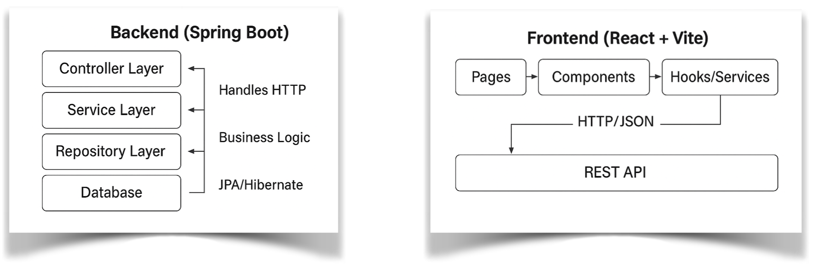

# **Introduction**

When we talk about *full stack development*, we are speaking about much
more than stitching together a backend and a frontend. We are speaking
about building a **living, breathing system**, one that accepts input,
processes it with precision, and presents it back in a way that humans
can understand and act upon. This book is your guided tour through that
entire process.

I will not only take you through the syntax and semantics of Spring Boot
and React, but will also train you to **think like a software
architect**. We will move deliberately, as engineers, not copy-paste
hobbyists, because our aim is not just to “make
something work,” but to **make something worth building**.

### **The Project at a Glance**

We will construct a **Product Management System** that is both realistic
and extendable, the kind of project that could sit comfortably in a
production environment with real users and real data.

**Our backend** will be a **Spring Boot 3.x REST API**:

> **Secure**: authentication and authorization with JWT.
>
> **Reliable**: layered architecture separating concerns cleanly.
>
> **Performant**: caching with Redis, database migrations with Flyway,
> and pagination.
>
> **Observable**: metrics via Actuator and Prometheus.
>
> **Tested**: using Spring Boot Test, Testcontainers, and JUnit.

**Our frontend** will be a **React SPA built with Vite**:

> **Responsive**: optimized for desktop and mobile.
>
> **User-friendly**: clear UI design, form validation, and instant
> feedback via notifications.
>
> **Connected**: consuming our API securely and efficiently.
>
> **Maintainable**: modular components, reusable hooks, and clean state
> management.

When completed, this system will stand as a portfolio-worthy example of
your capability to design, implement, and deploy a full stack
application from zero to production.

### **Our Development Philosophy**

We will follow three guiding principles throughout this book:

> **Understand before you implement**: I will explain *why* each
> decision is made, often contrasting with alternative approaches,
> whether from other Java stacks or entirely different ecosystems like
> Node.js, Django, or Ruby on Rails.
>
> **Build incrementally**: Each chapter adds one layer of complexity,
> allowing you to test, verify, and internalize before moving on.
>
> **Work like a professional**: We will integrate GitHub workflows,
> incremental branches, API testing, environment configuration, and even
> a Maven-to-Gradle migration, because in real-world projects, these
> transitions happen.

### **The High-Level Architecture**

Before we write a single line of code, we must see the *map*.

The two will communicate over **HTTP/JSON**, with secure endpoints
protected by JWT authentication.

In **Part V**, we will containerize both backend and frontend with
Docker, configure them for deployment, and add monitoring to keep them
healthy.

### **How You Will Work Through This Book**

This is not a spectator sport. From the very first chapter, you will
**clone our GitHub repository**, check out the starting branch, and
**code along** with me. Our repository is structured so you can either
work sequentially from Chapter 1 to the end, compare your work against
the official branch at any point or join the project midstream if you
wish, just check out the branch for that chapter.

You will also have **appendices** at your disposal, think of them as
your “*professor’s office
hours*” in print form. They include:

>Follow-along workflow diagrams
>
>GitHub branching and recovery techniques
>
>IDE setup and productivity shortcuts
>
>Spring Boot annotations cheat sheet
>
>Common error troubleshooting
>
>Deployment and security checklists.

### **A Note on Tools**

You will begin this journey using **Maven** to build the backend,
because it is widely known and straightforward for beginners. Later, we
will transition to **Gradle**, a faster, more flexible build tool, and I
will show you exactly how to migrate. On the frontend, we will use
**Vite** for its speed and modern tooling benefits over traditional
React setups.

### **Final Words Before We Begin**

I will be your guide, but you are the builder. Approach each chapter not
as a task to finish, but as a **skill to master**. By the final page,
you will not only have built a professional-grade full stack
application, but you will also understand the principles, patterns, and
workflows that allow professional developers to build *any* application.

Let’s begin our journey by painting the
high-level picture of the system we’re going to
build. So, open your IDE, clone the repository, and
let’s step into the engine room of our system:
**the backend**.
